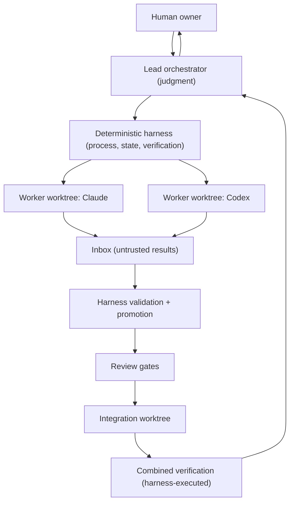
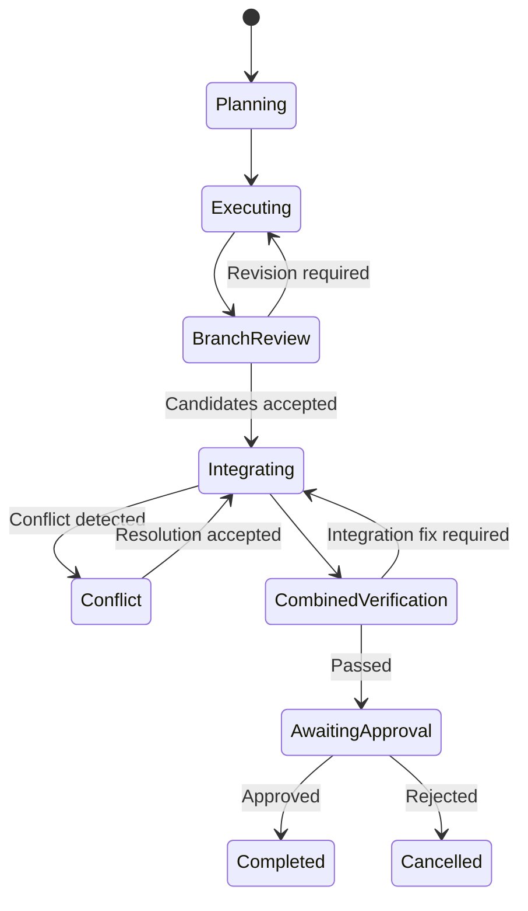

# Hydra-Swarm Architecture

## 1. Purpose

Coordinate multiple heterogeneous coding agents working concurrently on one repository, safely: isolated execution, evidence-gated acceptance, controlled convergence, human authority over irreversible actions.

## 2. Design goals

1. No two write-capable agents share a working tree.
2. Agents return evidence, not claims; the harness reproduces evidence before it counts.
3. Discovery parallelizes; convergence is serialized through one integration worktree.
4. Humans (or explicit policy) authorize merge, push, deploy, and destructive operations.
5. Vendor neutrality: implementer/reviewer/explorer roles are fillable by any supported CLI within its capability limits.
6. Reproducibility: every gate decision traceable to versioned specs and promoted evidence.
7. Recoverability: a replacement lead resumes any run from Git + the external state store alone.
8. Least privilege: each agent gets the minimum filesystem, Git, and network access its role needs.
9. Graph intelligence informs review (Wave 1+); the system degrades gracefully without it.
10. Workers are untrusted processes; no worker output becomes authoritative without harness validation.

## 3. Non-goals

An LLM review — from any vendor — is never a substitute for tests or human approval. A clean Git merge is never proof of semantic compatibility. The system never pushes, deploys, or merges to primary without human/policy authorization.

## 4. Core principles

### 4.1 Git is the source of truth
Branches, commits, diffs, harness-executed test results, and merge ancestry define authoritative implementation state.

### 4.2 One writing agent, one worktree
Every write-capable agent receives one bounded task, one branch, one worktree, an explicit ownership boundary, and an acceptance contract.

### 4.3 Parallelize discovery; control convergence
Exploration, impact analysis, and review parallelize freely. Integration is serialized through one integration agent in one integration worktree.

### 4.4 Evidence, not claims
Every result includes commit SHA, files changed, verification commands, and outcomes — as **claims**. The harness re-runs verification itself. Agent-reported results are untrusted until reproduced.

### 4.5 The lead recommends; policy authorizes
Merge to primary, push, deploy, destructive Git operations, secret changes, and irreversible migrations remain policy-controlled.

### 4.6 Instructions are ledger events
No instruction reaches a running agent outside a versioned task specification recorded in the run ledger. Mid-turn instruction injection is prohibited; course-correction happens at turn boundaries via `resume()` with an amended, version-bumped spec (see `vendor-adapters.md`).

### 4.7 Deterministic gates decide; probabilistic tools inform

| Evidence | Authority |
|---|---|
| Git commit and diff | Authoritative implementation state |
| Harness-executed tests | Acceptance gate |
| Ownership diff audit | Acceptance gate |
| Build / type / lint results | Acceptance gate |
| GitNexus findings (Wave 1+) | Impact evidence (risk input) |
| Graphify EXTRACTED edges (Wave 2) | Investigation triggers |
| Graphify INFERRED edges (Wave 2) | Review questions only |
| LLM review | Advisory judgment |
| Agent-reported tests | Untrusted until reproduced |

### 4.8 Authoritative-state writes (trust decision)

**Wave 0 model — privileged lead (chosen deliberately):**

> Workers never write authoritative state. The lead modifies authoritative state only through harness interfaces.

The lead (Claude Code) invokes harness scripts via its shell; since lead and scripts run as the same OS user, the lead *could* technically bypass the scripts. This is therefore a **protocol boundary for the lead** and a **real boundary for workers** (workers cannot reach the state store at all — see `state-and-worktrees.md`). This is honest and sufficient for Wave 0: the threat model treats workers as untrusted and the lead as a trusted-but-audited coordinator whose every state mutation flows through logged script invocations.

**Hardening milestone (roadmap):** a harness daemon owning the state directory under separated privileges, exposing narrow operations (`create-run`, `register-task`, `record-dispatch`, `promote-result`, `record-verification`, `record-review`, `close-run`), with the lead holding read-only access to promoted views. Deferred until the core loop is proven.

## 5. System model

## 6. Responsibility separation (normative)

| Layer | Owner |
|---|---|
| Planning, decomposition, review judgment | Lead (Claude Code) |
| Process launch, timeout, cancellation | Deterministic harness |
| Worktree and branch lifecycle | Deterministic harness |
| Ledger and usage arithmetic | Deterministic harness |
| Result validation and promotion | Deterministic harness |
| Implementation | Assigned coding agent |
| Verification execution | Deterministic harness (sandboxed) |
| Integration-ready squash commits | Deterministic harness |
| Integration decisions | Lead, using promoted evidence only |
| Merge / push / deploy approval | Human / policy |

The lead is the current lead *implementation*, not the permanent source of truth. Everything the lead knows must be reconstructable from Git plus the external state store. Lead portability: any-CLI-lead is the architecture target; Claude Code is the only lead through Wave 2; Codex is the first promotion target; OpenCode/Kimi leadership is a compatibility objective, not an acceptance criterion.

## 7. Run state machine

Task states: `planned, ready, running, blocked, completed_unreviewed, revision_required, accepted, rejected, integrated, verified`. Every transition is a ledger event written by the harness. Agent prose never mutates task state. Spec amendments during `running` are ledger events, not state transitions.

## 8. Failure and recovery

**Agent failure:** preserve the worktree; record branch, HEAD, and uncommitted changes; determine recoverability; resume or replace using existing evidence; never delete a worktree before recovery or explicit abandonment.

**Stale base:** if primary moves mid-run, do not silently rebase candidates. Finish against the recorded base; integrate in the run's integration worktree; update-to-latest-primary as a separate step with re-verification. This separates agent-to-agent defects from upstream drift.

**Failed combined verification:** identify the smallest responsible scope — candidate defect (return to owning worktree), cross-candidate incompatibility (integration defect task), pre-existing failure (document; decide if blocking), environment failure (retry only after ruling out code).

**Lead replacement:** only at a recorded checkpoint. The replacement reconstructs state from Git + the state store; conversational context is never load-bearing.
