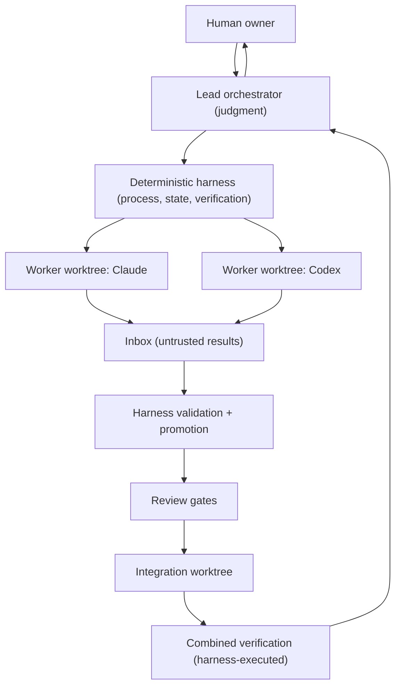
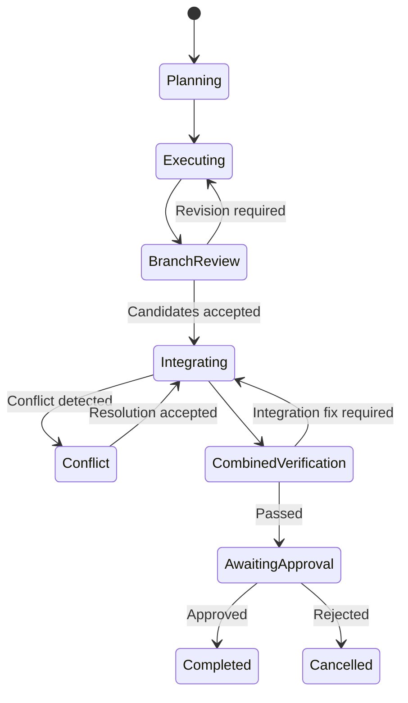

# Hydra-Swarm Architecture

## 1. Purpose

Coordinate multiple heterogeneous coding agents working concurrently on one repository, safely: isolated execution, evidence-gated acceptance, controlled convergence, human authority over irreversible actions.

## 2. Design goals

1. No two write-capable agents share a working tree.
2. Agents return evidence, not claims; the harness reproduces evidence before it counts.
3. Discovery parallelizes; convergence is serialized through one integration worktree.
4. Humans (or explicit policy) authorize merge, push, deploy, and destructive operations.
5. Vendor neutrality: implementer/reviewer/explorer roles are fillable by any supported CLI within its capability limits.
6. Reproducibility: every gate decision traceable to versioned specs and promoted evidence.
7. Recoverability: a replacement lead resumes any run from Git + the external state store alone.
8. Least privilege: each agent gets the minimum filesystem, Git, and network access its role needs.
9. Graph intelligence informs review (Wave 1+); the system degrades gracefully without it.
10. Workers are untrusted processes; no worker output becomes authoritative without harness validation.

## 3. Non-goals

An LLM review — from any vendor — is never a substitute for tests or human approval. A clean Git merge is never proof of semantic compatibility. The system never pushes, deploys, or merges to primary without human/policy authorization.

## 4. Core principles

### 4.1 Git is the source of truth
Branches, commits, diffs, harness-executed test results, and merge ancestry define authoritative implementation state.

### 4.2 One writing agent, one worktree
Every write-capable agent receives one bounded task, one branch, one worktree, an explicit ownership boundary, and an acceptance contract.

### 4.3 Parallelize discovery; control convergence
Exploration, impact analysis, and review parallelize freely. Integration is serialized through one integration agent in one integration worktree.

### 4.4 Evidence, not claims
Every result includes commit SHA, files changed, verification commands, and outcomes — as **claims**. The harness re-runs verification itself. Agent-reported results are untrusted until reproduced.

### 4.5 The lead recommends; policy authorizes
Merge to primary, push, deploy, destructive Git operations, secret changes, and irreversible migrations remain policy-controlled.

### 4.6 Instructions are ledger events
No instruction reaches a running agent outside a versioned task specification recorded in the run ledger. Mid-turn instruction injection is prohibited; course-correction happens at turn boundaries via `resume()` with an amended, version-bumped spec (see `vendor-adapters.md`).

Evidence is the sanctioned complement to instructions (v0.6.8.3): an amended (revise-round) dispatch materializes the recorded review verdicts a worker must address into a read-only, git-excluded `.hydra-context/revision-evidence/` bundle inside the worker's own worktree — file-first, prompt-light. The prompt carries only compact manifest metadata (paths, SHA-256s, trust labels); the bundle content is explicitly labelled untrusted reviewer *data*, never instructions, and every entry is provenance-checked against `review_verdict` ledger events. This closes issue #26 (workers could not read the verdicts they were asked to fix) without ever granting workers access to `authoritative/`.

### 4.7 Deterministic gates decide; probabilistic tools inform

| Evidence | Authority |
|---|---|
| Git commit and diff | Authoritative implementation state |
| Harness-executed tests | Acceptance gate |
| Ownership diff audit | Acceptance gate |
| Build / type / lint results | Acceptance gate |
| GitNexus findings (Wave 1+) | Impact evidence (risk input) |
| Graphify EXTRACTED edges (Wave 2) | Investigation triggers |
| Graphify INFERRED edges (Wave 2) | Review questions only |
| LLM review | Advisory judgment |
| Recorded review verdict (append-only store, v0.6.8.3) | Authoritative record of the review judgment; reviewer process exit is telemetry, never a verdict. "Only a recorded `accept` proceeds" is a lead-protocol rule — `squash`/`integrate` gate on promotion + squash records, not on the review store |
| Revision-evidence bundle (`.hydra-context/`, v0.6.8.3) | Untrusted reviewer evidence handed to a revise-round worker as data — input, never a gate |
| `amendment_check` assertions (v0.6.8.1) | Mandatory worker-prompt gate on revise rounds; promotion still re-verifies independently |
| Agent-reported tests | Untrusted until reproduced |

### 4.8 Authoritative-state writes (trust decision)

**Wave 0 model — privileged lead (chosen deliberately):**

> Workers never write authoritative state. The lead modifies authoritative state only through harness interfaces.

The lead (Claude Code) invokes harness scripts via its shell; since lead and scripts run as the same OS user, the lead *could* technically bypass the scripts. This is therefore a **protocol boundary for the lead** and a **real boundary for workers** — with one vendor-asymmetric exception: the state store is a separate path that is never handed to a worker, and for Codex (`workspace-write` sandbox) and Kimi (`srt`) the OS sandbox structurally confines writes to the worktree, so those workers cannot reach the state store at the OS level. Claude workers, however, run under `--permission-mode bypassPermissions` with **no OS sandbox**, so a Claude worker *could* read/write `~/.local/state/...` at the OS level. Today the real boundaries for the Claude case are: the state store is not in the worker's known paths, the post-hoc ownership audit, and no remote credentials in the worker env (see `state-and-worktrees.md` and the drift note in §9). This is honest and sufficient for Wave 0: the threat model treats workers as untrusted and the lead as a trusted-but-audited coordinator whose every state mutation flows through logged script invocations.

**Hardening milestone (roadmap):** a harness daemon owning the state directory under separated privileges, exposing narrow operations (`create-run`, `register-task`, `record-dispatch`, `promote-result`, `record-verification`, `record-review`, `close-run`), with the lead holding read-only access to promoted views. Deferred until the core loop is proven.

## 5. System model

## 6. Responsibility separation (normative)

| Layer | Owner |
|---|---|
| Planning, decomposition, review judgment | Lead (Claude Code) |
| Process launch, timeout, cancellation | Deterministic harness |
| Worktree and branch lifecycle | Deterministic harness |
| Ledger and usage arithmetic | Deterministic harness |
| Result validation and promotion | Deterministic harness |
| Implementation | Assigned coding agent |
| Verification execution | Deterministic harness (sandboxed) |
| Integration-ready squash commits | Deterministic harness |
| Integration decisions | Lead, using promoted evidence only |
| Merge / push / deploy approval | Human / policy |

The lead is the current lead *implementation*, not the permanent source of truth. Everything the lead knows must be reconstructable from Git plus the external state store. Lead portability: any-CLI-lead is the architecture target; Claude Code is the only lead through Wave 2; Codex is the first promotion target; OpenCode/Kimi leadership is a compatibility objective, not an acceptance criterion.

## 7. Run state machine

Conceptual task lifecycle: `planned, ready, running, blocked, completed_unreviewed, revision_required, accepted, rejected, integrated, verified`. This is the *designed* vocabulary, not what `status.sh` reports today. The implemented, observable status vocabulary (reconstructed from the ledger event stream in `status.ts`) is narrower: `running, completed, failed, cancelled, timed_out, unknown`. There are no one-for-one ledger transition events named after the conceptual states; state is inferred from events like `task_started`, `agent_exited`, `agent_cancelled`, and `agent_timed_out`. Agent prose never mutates task state. Spec amendments during `running` are ledger events, not state transitions.

## 8. Failure and recovery

**Agent failure:** preserve the worktree; record branch, HEAD, and uncommitted changes; determine recoverability; resume or replace using existing evidence; never delete a worktree before recovery or explicit abandonment.

**Stale base:** if primary moves mid-run, do not silently rebase candidates. Finish against the recorded base; integrate in the run's integration worktree; update-to-latest-primary as a separate step with re-verification. This separates agent-to-agent defects from upstream drift.

**Failed combined verification:** identify the smallest responsible scope — candidate defect (return to owning worktree), cross-candidate incompatibility (integration defect task), pre-existing failure (document; decide if blocking), environment failure (retry only after ruling out code).

**Lead replacement:** only at a recorded checkpoint. The replacement reconstructs state from Git + the state store; conversational context is never load-bearing.

## 9. As-built drift notes (audit 2026-07-13)

Where the Wave 0–2 implementation diverged from the normative text above. Each
is either amended here or flagged as a code follow-up (never left silently
disagreeing).

- **§4.8 / §4.2 — worker OS confinement is vendor-asymmetric.** The claim that
  workers "cannot reach the state store" is enforced structurally for Codex
  (`workspace-write` sandbox) and Kimi (`sandbox-exec`, writes confined to the
  worktree), but **Claude workers run under `--permission-mode bypassPermissions`
  with no OS sandbox** — a Claude worker could read/write `~/.local/state/...` at
  the OS level. Today the real boundaries are: the state store is a separate path
  (not handed to the worker), the post-hoc ownership audit, and no remote
  credentials in the worker env. *Disposition: honest as a Wave 0–2 "privileged
  lead + audited worker" model; the daemon milestone closes it. Also amended in
  `trust-and-permissions.md` §11.*
- **§4.6 — amendment content is partially ledgered** (improved v0.6.8.1–0.6.8.3,
  not closed). `task_spec_amended` now records the version bump, delivery, and
  the amendment reason, and the amended spec (including any `amendment_check`
  list) is atomically rewritten and mirrored into the worktree's read-only
  `.hydra-task.yaml` — but a substantive hand edit to other spec fields is
  still not captured as a ledger delta. *Disposition: code follow-up (record
  the full spec delta); tracked in `roadmap.md` later-enhancements.*
- **§4.6 / §4.7 — review verdicts and revision evidence (v0.6.8.3).** The
  authoritative verdict record moved from a ledger-telemetry event to the
  append-only store `authoritative/reviews/<task>/<seq>-<reviewed_head>.json`
  (highest valid generation wins; full history retained), and revise-round
  workers receive verdict evidence through the `.hydra-context/` bundle
  described in §4.6 — as data, never instructions. No new promote-side gate
  shipped in 0.6.8.3; the promote gate sequence is unchanged.
- **§7 — the run state machine is inferred, not asserted.** `run-init.sh` writes
  `state: planning` and no script advances it through
  executing/branch_review/integrating/…; task/run state is *reconstructed from
  the ledger event stream* (which is faithful and sufficient for recovery), but
  the enumerated `run.schema.json` states are never emitted as transitions.
  *Disposition: the doc's intent (every transition is a harness-written ledger
  event) holds via the event vocabulary; the explicit state field is vestigial —
  either drive it or drop it from the schema (code follow-up).*
- **§4.7 — upheld.** Graph intelligence (GitNexus `graph_impact`, Graphify
  `graphify_investigation`) is emitted `advisory:true` and never gates
  integration, as specified. Confirmed by the run-0013 self-audit.
