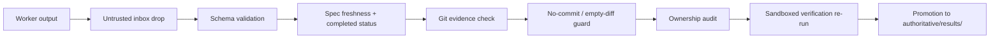

# Hydra-Swarm — Task, Result, and Review Contracts

## 1. Task specification (instantiated)

```yaml
task_id: canvas-node-validation
run_id: "0042"
spec_version: 1
base_commit: 91df24a
branch: hydra/0042/canvas-node-validation
worktree: ~/worktrees/<repo>/run-0042-canvas-validation
assigned_vendor: claude            # claude | codex (Wave 0)
writable_paths: [src/canvas/**, tests/canvas/**]
read_only_paths: [src/shared/types/**, docs/**]
inaccessible_paths: [.env*, secrets/**, hydra/**]
objective: >
  Add typed connection validation for canvas nodes.
acceptance_criteria:
  - Invalid connections rejected with typed errors
  - Focused tests cover the validator
verification:                       # from tracked policy or human-approved spec ONLY
  - pnpm test tests/canvas
  - pnpm typecheck
integration_notes: >
  Exposes validateConnection(); UI consumers arrive in a later task.
timeout_minutes: 45
max_cost_usd: 3.00
```

### 1.1 Amendment protocol

Amended specs supersede by version (`spec_version: 2`, `supersedes: v1`, `amendment_reason`, `delivered_via: resume|restart`). Every amendment is a ledger event. Gates evaluate only the latest version; results claiming an older version are stale and rejected at promotion. An amendment may also carry an optional `amendment_check` list of shell assertions (v0.6.8.1): these are rendered as a mandatory verification block in the worker prompt, so a revise round cannot be satisfied by "the pre-existing tests still pass" alone. `amend-task` accepts `@file` for both `amendment_reason` and `amendment_check`, and a hand-edited reason in the spec is never silently overwritten by a shorter CLI argument.

## 2. Result contract

### 2.1 Worker-emitted portion (claims — untrusted)

Written by the worker **only** to `.hydra-result.json` in its own worktree (or stdout captured by the adapter). The adapter bridges that file into `inbox/<agent-run-id>/result.json`; workers cannot reach `authoritative/` or the state store.

```json
{
  "task_id": "canvas-node-validation",
  "run_id": "0042",
  "spec_version": 1,
  "vendor": "claude",
  "session_id": "…",
  "status": "completed",
  "branch": "hydra/0042/canvas-node-validation",
  "base_commit": "91df24a",
  "head_commit": "ca827d1",
  "summary": "Added typed connection validation and focused tests.",
  "files_changed": ["src/canvas/connections/validate.ts",
                    "tests/canvas/connections/validate.test.ts"],
  "verification_claims": [
    {"command": "pnpm test tests/canvas", "status": "passed"},
    {"command": "pnpm typecheck", "status": "passed"}
  ],
  "risks": [],
  "unresolved_questions": [],
  "suggested_additional_checks": []
}
```

Completion is invalid if the worker modified files without committing (unless the task explicitly requested an uncommitted prototype).

### 2.2 Promotion pipeline (harness)



Checks, in order: (1) `result.schema.json` validation; (2) spec-version freshness (`stale_spec`) and worker-declared `completed` status (`not_completed`); (3) Git evidence — claimed branch and commits exist, branch descends from declared base, working tree committed; (4) `no_commit` guard — rejects `head == base` or an empty diff (work left uncommitted); (5) full ownership audit (`trust-and-permissions.md` §5); (6) mandatory verification commands from tracked policy re-run in the candidate worktree under the verification sandbox (`trust-and-permissions.md` §6); (7) promoted result = worker claims + harness-observed outcomes + divergence flags. Claim-vs-observed divergence is recorded per vendor. Rejection at any step emits `result_rejected` with the reason; the worktree is preserved.

## 3. Branch review gate

**Inputs:** latest task spec; base/head SHAs; full diff; commit history; the **promoted** result (never the raw drop); harness verification record; graph impact report (Wave 1+); repository instructions.

**Sequence:**
1. Confirm branch descends from declared base.
2. Confirm worktree clean.
3. Confirm ownership audit passed (already enforced at promotion; reviewer re-checks the record).
4. Inspect diff and commit history.
5. Identify changed symbols and public contracts.
6. (Wave 1+) Query dependency/call-chain impact — risk *input* only.
7. Locate affected tests and consumers.
8. Confirm the harness verification record; request targeted additional checks if warranted.
9. Evaluate security, compatibility, migration, operational risk.
10. Produce a structured verdict.

**Verdict:**

```yaml
task_id: canvas-node-validation
verdict: accept          # accept | revise | reject | blocked
reviewed_base: 91df24a
reviewed_head: ca827d1
reviewer: codex
reviewer_vendor: codex/gpt-5.6-sol
blocking_findings: []
non_blocking_findings:
  - Add an integration test when the UI consumes the validator.
required_integration_checks:
  - Verify edge creation from the canvas interaction layer.
risk: low                # low | medium | high | critical
```

Only `accept` candidates enter integration. `revise` returns to the same worktree unless scope/ownership changes materially (then: spec amendment or task split). Review policy: cross-vendor review mandatory for `risk: high|critical`, architecture, security, and migrations (Wave 1 formalizes; in Wave 0 with two vendors, Codex reviews Claude and vice versa by default).

## 4. Squash policy (harness-created)

Workers do **not** rewrite their own history — self-squashing lets a worker hide intermediate or reverted changes from review.

1. Worker produces normal commits.
2. Review operates on the **complete candidate branch**.
3. Harness records `candidate_head`.
4. Harness creates the integration-ready squash commit.
5. Original branch is preserved for forensics.
6. Integration cherry-picks the harness-created squash.

```yaml
candidate_head: abc1234
integration_commit: def5678
source_commits: [111aaaa, 222bbbb]
```

## 5. Integration worktree lifecycle

**Creation:** from a recorded primary-branch commit — `git worktree add … -b hydra-integration/<run-id> <base-commit>`. The recorded base must not silently move during the run.

**Candidate application** (one at a time, dependency order):
1. Record current integration HEAD.
2. Cherry-pick the harness squash commit.
3. Stop on textual conflicts.
4. Run task-specific smoke verification (harness, sandboxed).
5. Record resulting integration HEAD.
6. Continue only after success.

**Ordering:** explicit task dependencies → shared contracts/schemas before consumers → backend before dependent UI → lower-risk foundational changes before high-risk consumers. Never alphabetical or completion-time order.

**Conflict taxonomy:**

| Conflict | Detection | Response |
|---|---|---|
| Textual | Cherry-pick/merge failure | Stop; assign resolution |
| Ownership | Overlapping changed paths | Re-plan or serialize |
| Contract | Incompatible interfaces/schemas | Escalate to lead; explicit contract decision |
| Behaviour | Combined tests fail | Integration defect task |
| Architectural | Review/graph shows broken boundaries | Rework candidate or approve architecture change |
| Documentation | Implementation contradicts spec | Resolve authoritative intent first |

**Integration-only changes:** permitted only when the defect emerges specifically from combining accepted candidates, the change is small and contained, and original ownership can't resolve it without cycling. Committed separately, labelled (`integration: align canvas validation with edge creation contract`). Feature additions and unrelated cleanup prohibited.

## 6. Combined verification gate

Layers (all harness-executed, sandboxed):

| Layer | Purpose |
|---|---|
| Repository state | Clean worktree, expected commits |
| Ownership audit | Only approved candidate + labelled integration changes exist |
| Static checks | Format, lint, typecheck, schema validation |
| Targeted tests | Changed subsystems and affected consumers |
| Cross-component tests | Contracts between integrated components |
| Full suite | Broader regressions when feasible |
| Build/package | Production build succeeds |
| Security checks | Dependencies, secrets, permissions, unsafe patterns |
| Graph impact review (Wave 1+) | Combined structural changes, unexpected coupling |
| Documentation check | Material behaviour/interface changes documented |

Final review questions: do integrated commits jointly satisfy the objective; did one candidate invalidate another's assumptions; are APIs/schemas/events/persisted data compatible; are new paths tested; did coupling increase unexpectedly; are failure handling and observability adequate; are migrations reversible and ordered; does implementation match approved design intent; is the branch safe to propose for merge?

**Final verdict:**

```yaml
run_id: "0042"
integration_branch: hydra-integration/0042
base_commit: 91df24a
head_commit: 8a0c76e
included_tasks: [canvas-node-validation, video-export-status]
excluded_tasks: [auth-refresh]
verification_status: passed
verification_executor: harness
risk: medium
merge_recommendation: ready_for_human_review
required_human_decisions: []
known_limitations: [...]
```

## 7. Run ledger

Append-only `authoritative/ledger/events.jsonl`, harness-written. Dispatch-originated entries also carry `agent_run_id` and `dispatch_instance_id` so a task retry or streaming-detector window can be correlated to a specific dispatch attempt.

```json
{"time":"…","event":"run_started","run_id":"0042"}
{"time":"…","event":"worktree_bootstrapped","task_id":"…","status":"ok"}
{"time":"…","event":"task_started","task_id":"…","vendor":"claude","session_id":"…","agent_run_id":"…","dispatch_instance_id":"…"}
{"time":"…","event":"task_spec_amended","task_id":"…","from":"v1","to":"v2","delivery":"resume"}
{"time":"…","event":"result_dropped","task_id":"…","inbox":"…"}
{"time":"…","event":"result_promoted","task_id":"…","head":"ca827d1","divergence":false}
{"time":"…","event":"result_rejected","task_id":"…","reason":"ownership_violation"}
{"time":"…","event":"review_verdict","task_id":"…","verdict":"accept","reviewer":"codex"}
{"time":"…","event":"squash_created","task_id":"…","integration_commit":"def5678"}
{"time":"…","event":"candidate_integrated","task_id":"…","head":"8a0c76e"}
{"time":"…","event":"combined_verification","status":"passed"}
{"time":"…","event":"agent_exited","task_id":"…","vendor":"…","agent_run_id":"…","dispatch_instance_id":"…","exit_code":"0"}
{"time":"…","event":"agent_timed_out","task_id":"…","vendor":"…","agent_run_id":"…","dispatch_instance_id":"…","reason":"stalled"}
{"time":"…","event":"agent_cancelled","task_id":"…","vendor":"…","agent_run_id":"…","dispatch_instance_id":"…"}
{"time":"…","event":"verification_executed","task_id":"…","status":"passed"}
{"time":"…","event":"agent_loop_suspected","task_id":"…","vendor":"codex","agent_run_id":"…","dispatch_instance_id":"…","episode_id":"…"}
{"time":"…","event":"agent_loop_confirmed","task_id":"…","vendor":"codex","agent_run_id":"…","dispatch_instance_id":"…","episode_id":"…"}
{"time":"…","event":"agent_loop_cleared","task_id":"…","vendor":"codex","agent_run_id":"…","dispatch_instance_id":"…","episode_id":"…","reason":"git_progress"}
{"time":"…","event":"run_completed","run_id":"0042"}
```

The ledger + Git enable full recovery if the lead is interrupted or replaced. Usage/cost events and capability aggregation are Wave 2 (`vendor-adapters.md` §5).

## 8. As-built drift notes (audit 2026-07-13)

- **§2.1 completion rule — now enforced by two gates.** "Completion is invalid
  if the worker modified files without committing" is enforced at promotion:
  `no_commit` (head == base or empty `base...head` diff) and the requirement that
  the drop's `status` is `completed` (`not_completed`). Both were added after a
  worker left its output *untracked* and every other gate passed.
- **Result handoff (§2.1) — as-built.** Workers write `.hydra-result.json` in
  their **own worktree**; the adapter bridges it to the inbox (workers never
  reach the state store). If a worker commits but omits the self-report, the
  adapter derives the drop from git evidence (`hydra_derive_drop_from_git`) —
  head + files are git facts, `verification_claims` stays empty, and promotion
  re-verifies. This is the "or stdout captured by the adapter" path.
- **Ledger vocabulary — extended.** Beyond §7's list, the harness now emits
  `agent_cancelled`, `agent_usage`, `review_started`/`review_completed`,
  `index_built`, `graph_impact`, `graphify_baseline`/`graphify_investigation`,
  `herdr_pane_started`, `concurrency_wait`, and `observability_anomaly`.
- **Review verdicts are advisory; the human authorizes integration.** In run
  0015 a `revise` verdict was overridden by explicit human authorization to
  merge (recorded in the merge commit + Design Spec §4.2). "Only `accept`
  integrates" is the harness default; the human can override, on the record.
- **Divergence (§2.2) — refined.** `promote.sh` flags divergence only when a
  worker's claim *contradicts* the harness observation on the **same** command;
  a worker running its own (different) checks is the expected provenance gap, not
  a divergence.
